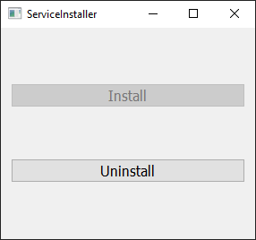
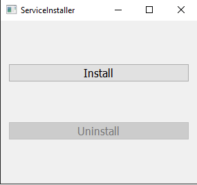

# Bandwidth-Monitor-Service

A windows service to monitor your internet bandwidth.

## How to use this program

1. Download the BandwidthMonitorService
2. Install npcap-1.72.exe
3. Run ServiceInstaller.exe as administrator.

|        Service Installed         |        Service Uninstalled         |
| :------------------------------: | :--------------------------------: |
|  |  |

4. Press install button to isntall service and uninstall button to uninstall service.
